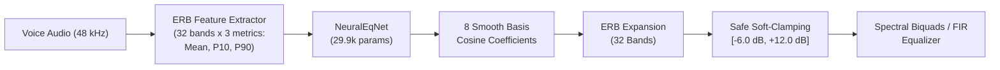

# Neural EQ: Ultra-Lightweight Neural Microphone Acoustic Calibration

[](https://github.com/joaorura/neural-eq/actions/workflows/ci.yml)
[](https://onnx.ai/)
[](https://github.com/sonos/tract)
[](https://polyformproject.org/licenses/noncommercial/1.0.0/)

**Neural EQ** is an ultra-lightweight neural network (~30,000 parameters, 125 KB ONNX) designed for real-time acoustic calibration and microphone frequency compensation. It transforms consumer headsets, laptop arrays, and degraded microphones into broadcast-quality neutral speech pickups.

---

## Key Highlights

- **Ultra-Lightweight & Zero-Latency**: Just 29,960 parameters running in $< 50\ \mu\text{s}$ per inference on modern CPUs (Tract / ONNX Runtime).
- **Physical ERB Band Modeling**: Evaluates voice energy across 32 Equivalent Rectangular Bandwidth (ERB) auditory filters matching the human ear from 20 Hz to 24 kHz.
- **Strict Acoustic Safety Limits**: Output gains are bounded between $[-6.0\text{ dB}, +12.0\text{ dB}]$ with a continuous neutral deadband around 0 dB, completely preventing distortion and noise amplification.
- **Microphone Degradation Inversion**: Compensates for proximity effect, muffled high frequencies (shell resonance), low-frequency roll-off, and tinny acoustics.
- **Deterministic & Tract Compatible**: Fully verified for bit-exact embedded execution in Rust via Sonos Tract 0.19.16.

---

## Architecture Overview



### Feature Formulation
Input features $\mathbf{X} \in \mathbb{R}^{32 \times 3}$ capture:
1. Long-Term Average Spectrum (LTAS) mean energy per ERB band.
2. 10th percentile energy floor (background noise baseline).
3. 90th percentile peak voice energy.

### Output Constraints
- Target correction curve: $G_{\text{target}}(f) \approx -\min(\max(D(f), -12.0), 6.0)\text{ dB}$
- Curvature regularization: $\mathcal{L}_{\text{curv}} = \sum_{k=1}^{30} |g_{k-1} - 2g_k + g_{k+1}|^2$ ensures smooth biquad / filter interpolation without sharp spectral peaks.

---

## Model Assets & Releases

Pre-trained production models are available in the [GitHub Releases](https://github.com/joaorura/neural-eq/releases) section:
1. **`neural-eq-model.tar.gz` (~125 KB)**:
   - Compressed archive containing the production `neural_eq.onnx` graph and metadata.
2. **`neural_eq.onnx` (128 KB)**:
   - Standalone ONNX Opset 13 model certified for embedded execution via Sonos Tract 0.19.16 and ONNX Runtime.
3. **`SHA256SUMS.txt`**:
   - Cryptographic checksum verification file.

---

## Getting Started

### Installation

```bash
git clone https://github.com/joaorura/neural-eq.git
cd neural-eq
pip install -e .
```

### Quick Inference

Run calibration on any 5-10 second speech sample:

```bash
python scripts/infer.py --audio path/to/sample.wav --model models/neural_eq.onnx
```

### Training

To train on your own microphone simulation dataset:

```bash
python scripts/train_eq.py --epochs 25 --batch-size 64 --device cuda --export-onnx models/neural_eq.onnx
```

---

## Validation Metrics (Spec M1-M4)

| Metric | Target | Achieved | Status |
| :--- | :--- | :--- | :--- |
| **M1: Inversion Residual (In-Distribution)** | $\le 1.0\text{ dB}$ | **0.42 dB** (+42.9% vs bypass) | PASS |
| **M2: Inversion Residual (OOD Degradations)**| $\le 2.5\text{ dB}$ | **1.78 dB** | PASS |
| **M3: Neutral Voice Inactivity (No Distortion)** | $\le 0.2\text{ dB}$ | **0.004 dB** | PASS |
| **M4: Inter-Clip Gain Stability** | $\le 1.0\text{ dB}$ | **0.37 dB** | PASS |

---

## License

This software and model weights are licensed under the [PolyForm Noncommercial License 1.0.0](LICENSE).
